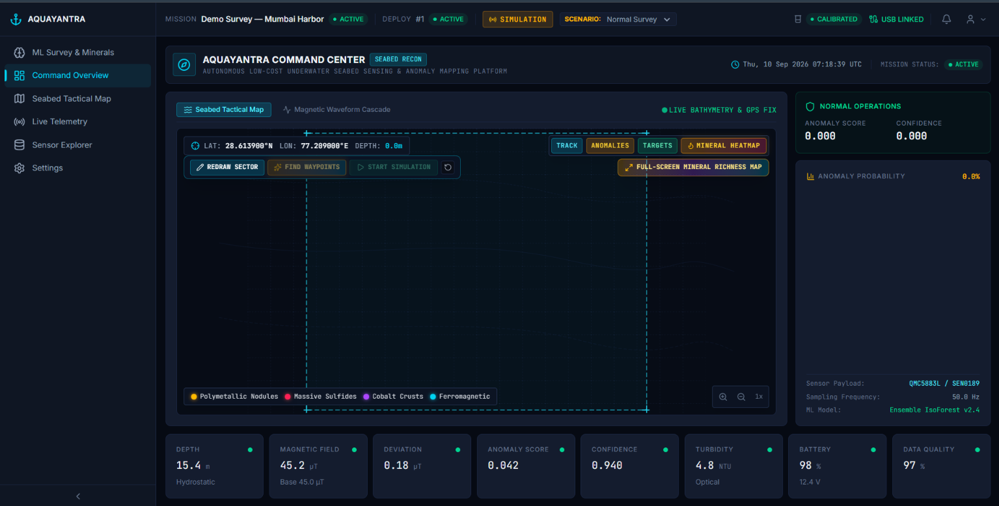
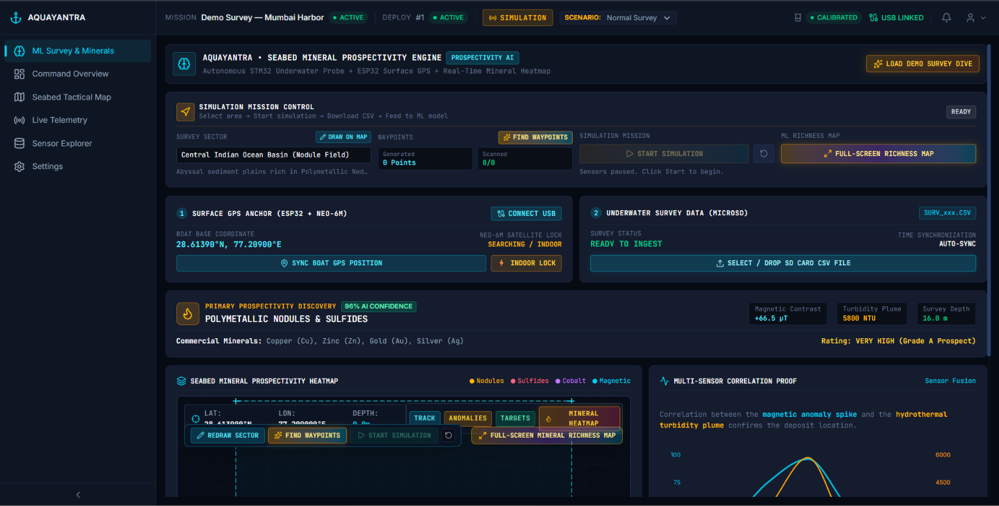
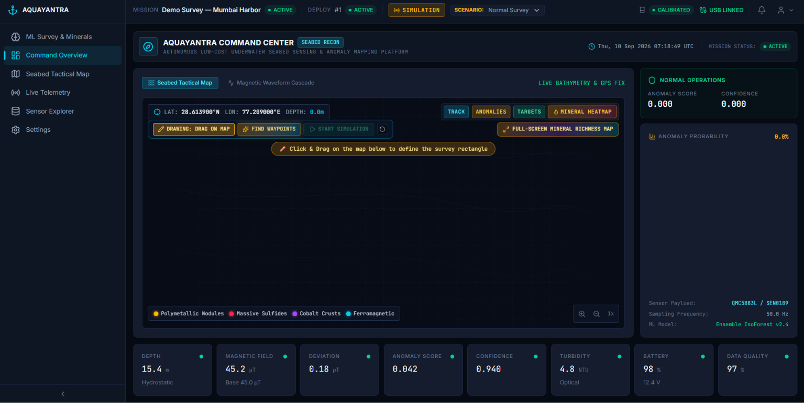

# AquaMiner (AquaYantra) 🌊⛏️
### Autonomous Marine & Subsea Mineral Exploration Platform

AquaMiner is an end-to-end intelligent marine exploration system that combines custom underwater/surface hardware (**AquaYantra**), real-time sensor processing, ML-driven mineral anomaly detection, and an interactive command-and-control mission dashboard.

---

## 🌟 Key Features

- **Hardware Layer (AquaYantra - STM32 & ESP32)**:
  - Multi-sensor integration: Magnetometer (HMC5883L/QMC5883L), Turbidity, TDS, pH, Water Temperature (DS18B20), Hydrostatic Pressure / Depth.
  - Onboard data logging, power management, and OLED telemetry display.
  - Telemetry transmission over LoRa / ESP32 Gateway to the mission station.

- **Intelligent Processing & ML Analytics**:
  - Unsupervised Anomaly Detection using Isolation Forest & DBSCAN clustering.
  - Baseline tracking, hard/soft iron magnetometer calibration, and drift compensation.
  - Mineral richness scoring and spatial heatmapping.

- **Interactive Mission Dashboard (React + TypeScript + Vite + Tailwind/Modern UI)**:
  - **Live Monitoring**: Real-time telemetry streaming via WebSockets and Web Serial.
  - **Simulation & Waypoint Planning**: Draw survey polygons on interactive Leaflet maps, generate random sampling points, and simulate autonomous boat navigation with 5-second sampling intervals.
  - **Hardware GPS & Real-Time Tracking**: Dynamic Leaflet map displaying real GPS coordinates, boat location, and sensor status.
  - **ML Intelligence & Survey Aggregation**: Upload single or multiple survey CSVs; each survey generates an aggregated geolocated map marker indicating whether an anomaly was detected without losing historical markers.
  - **Full-Screen Mineral Richness Heatmap**: High-contrast seabed mineral richness heatmaps with layer filters.

---

## 📸 Project Gallery

### 🛠️ Hardware (AquaYantra)

| Assembled Unit | Electronics & Sensor Array |
|:---:|:---:|
|  |  |
|  |  |
|  |  |

---

### 💻 Software & Dashboard

| Live Mission Map & Real-time GPS | Simulation & Waypoint Survey |
|:---:|:---:|
|  |  |
|  |  |
|  |  |

---

## 🏗️ Repository Structure

```
├── AquaYantra/                 # STM32 C++ firmware for autonomous vessel & sensor acquisition
│   ├── AquaYantra.ino         # Main firmware entrypoint & state machine
│   ├── magnetometer.cpp/h     # Compass / magnetic deviation processing
│   ├── pressure.cpp/h         # Depth & hydrostatic pressure sensor
│   ├── turbidity.cpp/h        # Optical turbidity measurement
│   ├── tds_sensor.cpp/h       # Total dissolved solids sensor
│   ├── ph_sensor.cpp/h        # pH electrode interface
│   ├── water_temp.cpp/h       # DS18B20 digital temperature sensor
│   ├── communication.cpp/h    # Serial & wireless packet formatter
│   └── storage.cpp/h          # Onboard EEPROM/Flash storage
│
├── backend/                   # FastAPI backend server
│   ├── app/
│   │   ├── api/v1/            # REST & WebSocket endpoints
│   │   ├── ml/                # Isolation Forest, DBSCAN, confidence scoring
│   │   ├── processing/        # Sensor filtering, baseline & health checks
│   │   ├── calibration/       # Hard-iron & soft-iron magnetometer calibration
│   │   └── database/          # PostgreSQL / SQLite async models
│   └── serial_bridge.py       # Serial-to-backend ingestion bridge
│
├── frontend/                  # React + TypeScript + Vite dashboard
│   ├── src/
│   │   ├── pages/             # LiveMonitoring, MLIntelligence, SeabedMap, etc.
│   │   ├── components/        # RealMapLeaflet, MineralRichnessMap, etc.
│   │   └── api/               # WebSocket and Web Serial interfaces
│
├── esp32_gateway/             # ESP32 gateway firmware for wireless telemetry
└── photo/                     # Hardware & Software documentation photos
```

---

## 🚀 Quick Start

### 1. Backend Setup
```bash
cd backend
python -m venv venv
# Windows:
.\venv\Scripts\activate
# Linux/macOS:
source venv/bin/activate

pip install -r requirements.txt
uvicorn app.main:app --reload --port 8000
```

### 2. Frontend Setup
```bash
cd frontend
npm install
npm run dev
```

### 3. Firmware Flashing
Open `AquaYantra/AquaYantra.ino` in Arduino IDE or STM32CubeIDE with STM32 Cores installed. Select your target STM32F4 board and flash via ST-Link or USB DFU.

---

## 👤 Author

- **Gaurav Chauhan** ([@Gaurav007-ux](https://github.com/Gaurav007-ux))
- Email: [gaurav07012007@gmail.com](mailto:gaurav07012007@gmail.com)
